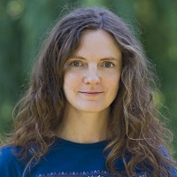

# Alesia Gres 

### Front-end Developer

&#128205; **Kraków, Poland**
___

### Contact Information: 

E-mail: inthelight987@gmail.com 

Discord: 

Linkedin: [Alesia Gres](https://www.linkedin.com/in/alesia-gres-3a757286/)
___

### Professional summary: 

Front-End Developer with the experience in designing user interfaces. Specialized in creating layouts, components, and establishing CSS architectures for new projects. Proficient in transforming old static websites into responsive UI designs. Skilled in interviewing and mentoring new team members, contributing to project growth and success. 

Current experience is with Blazor framework and .Net environment, in the same time dedicated to follow the latest JS technologies.
___

### Skills: 

- Blazor
- HTML
- CSS
- JavaScript
- BEM
- RWD
- Git
- Angular
- Angular material
- React.js
- Bootstrap
- Figma
- Material Design 
___

### Work Experience: 

**Front-end developer** / June 2021 - present, Intetics (Kraków)

- Creating responsive layouts for the web application based on graphic design
- Creating static pixel perfetc layouts for the local screen of the equipment
- Designing and introducing CSS architecture in a new application
- Creating and maintaining component library in the web application based on Figma design library
- Working closely with Project managers and UX/UI designers on creating feature requirements and UX/UI prototypes
- Creating UX/UI mockups in Figma based on the UI design library and corporate guidelines
- Bugfixing
- Working in a scrum team
- Participating in job interviews
- Mentoring and introducing new front-end team members to the project

**HTML Coder** / June 2018 - June 2021, Intetics (Minsk)
- Creating responsive layouts for web applications based on graphic design
- Developing and modifying existing parts of the application
- Transforming old static websites into responsive UI designs
- Creating landing pages
- Cooperating with the Project Manager in designing a better UX
- Bugfixing
- Communication with the client in English
- Working in a scrum team
___

### Education: 

**Belarusian State Uniwersity** / 2007-2012

International Relations Faculty
___

### Languages: 
- **English:** B2/C1
- **Polish:** B2/C1
- **Belarusian:** Native
- **Russian:** Native